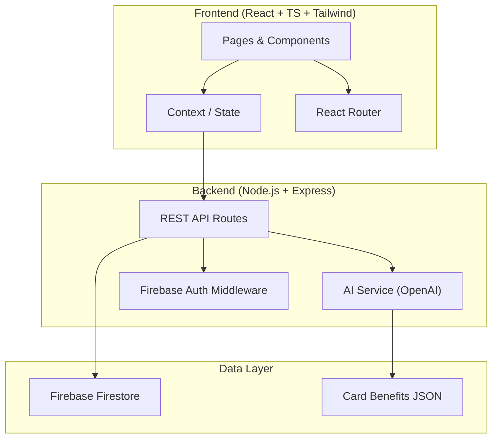
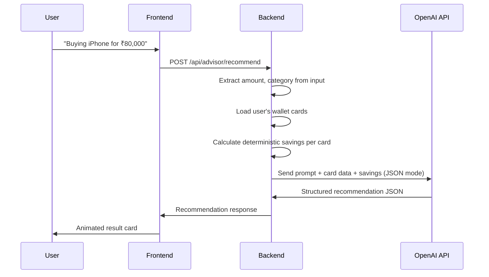

# CardWise AI — Implementation Plan

> *"CardWise AI tells you which card to swipe, before you swipe it — and shows you exactly how much money that decision just saved you."*

## Architecture Overview



**Monorepo structure**: `client/` (Vite + React) and `server/` (Express) in one repo. Both deploy independently.

---

## User Review Required

> [!IMPORTANT]
> **AI API Key**: The AI Purchase Advisor and Chatbot require an OpenAI-compatible API key. You'll need to provide one (OpenAI, Groq, or similar) as an environment variable. The system uses JSON mode / function calling for structured outputs — confirm which provider you prefer.

> [!IMPORTANT]
> **Tailwind Version**: You specified Tailwind. I'll use **Tailwind CSS v4** (the latest). It uses a CSS-first configuration approach (`@theme` in CSS) instead of `tailwind.config.js`. Confirm this is acceptable, or I can fall back to v3.

> [!WARNING]
> **Firebase Setup**: You'll need a Firebase project with Firestore + Auth enabled. I'll scaffold all the config, but you'll need to paste your Firebase credentials into a `.env` file.

> [!IMPORTANT]
> **Deployment**: Plan targets Vercel for frontend. Backend can deploy to Vercel Serverless Functions or Railway. For the hackathon demo, running both locally is also fine.

---

## Open Questions

1. **AI Provider**: OpenAI (GPT-4o-mini is fast & cheap) vs Groq (Llama, very fast) vs Google Gemini? This affects the SDK used.
2. **Auth Complexity**: For hackathon speed, should we do Firebase Auth with email/password only (skip Google Sign-In), or include Google Sign-In too?
3. **Real-time Data**: Should the dashboard update in real-time (Firestore listeners) or is page-refresh sufficient for demo?
4. **Number of Cards**: The brief says 8–10 Indian cards. Shall I include all of these: HDFC Millennia, HDFC Regalia, SBI Cashback, SBI SimplyCLICK, ICICI Amazon Pay, ICICI Sapphiro, Axis ACE, Axis Flipkart, Amex Gold, HDFC Infinia? Or a different set?

---

## Project Structure

```
d:\techforge ideathon\
├── client/                          # React + TypeScript + Tailwind (Vite)
│   ├── public/
│   │   └── favicon.svg
│   ├── src/
│   │   ├── assets/                  # Static images, icons
│   │   ├── components/
│   │   │   ├── ui/                  # Reusable: Button, Card, Input, Modal, Skeleton, Badge
│   │   │   ├── layout/             # Sidebar, TopBar, MobileNav
│   │   │   ├── dashboard/          # HealthScoreRing, SavingsCard, TrendChart, TopCard
│   │   │   ├── advisor/            # PurchaseInput, RecommendationCard, AlternativeCard
│   │   │   ├── chatbot/            # ChatWindow, ChatMessage, ChatInput
│   │   │   ├── wallet/             # CardSelector, CardTile, AddCardModal
│   │   │   └── comparison/         # ComparisonTable, WinnerBadge
│   │   ├── pages/
│   │   │   ├── Landing.tsx          # Hero + CTA (pre-auth)
│   │   │   ├── Login.tsx
│   │   │   ├── Signup.tsx
│   │   │   ├── Onboarding.tsx       # "Which cards do you own?"
│   │   │   ├── Dashboard.tsx
│   │   │   ├── PurchaseAdvisor.tsx
│   │   │   ├── Chatbot.tsx
│   │   │   ├── MyWallet.tsx
│   │   │   ├── CardComparison.tsx
│   │   │   └── Settings.tsx
│   │   ├── context/
│   │   │   ├── AuthContext.tsx
│   │   │   └── WalletContext.tsx
│   │   ├── hooks/
│   │   │   ├── useAuth.ts
│   │   │   ├── useWallet.ts
│   │   │   └── useAI.ts
│   │   ├── services/
│   │   │   ├── api.ts               # Axios instance + interceptors
│   │   │   ├── firebase.ts          # Firebase init
│   │   │   └── ai.ts                # AI API calls
│   │   ├── data/
│   │   │   └── cards.ts             # Card benefits dataset (shared with backend)
│   │   ├── types/
│   │   │   └── index.ts             # TypeScript interfaces
│   │   ├── utils/
│   │   │   └── savings.ts           # Savings calculation helpers
│   │   ├── App.tsx
│   │   ├── main.tsx
│   │   └── index.css                # Tailwind + design tokens
│   ├── index.html
│   ├── tailwind.config.ts
│   ├── vite.config.ts
│   ├── tsconfig.json
│   └── package.json
│
├── server/                          # Node.js + Express backend
│   ├── src/
│   │   ├── routes/
│   │   │   ├── auth.ts
│   │   │   ├── wallet.ts
│   │   │   ├── advisor.ts           # POST /api/advisor/recommend
│   │   │   ├── chat.ts              # POST /api/chat
│   │   │   └── comparison.ts
│   │   ├── services/
│   │   │   ├── ai.ts                # OpenAI integration with function calling
│   │   │   └── cardMatcher.ts       # Deterministic card matching logic
│   │   ├── data/
│   │   │   └── cards.json           # Master card benefits dataset
│   │   ├── middleware/
│   │   │   └── auth.ts              # Firebase token verification
│   │   ├── types/
│   │   │   └── index.ts
│   │   └── index.ts                 # Express app entry
│   ├── tsconfig.json
│   └── package.json
│
├── .env.example
├── .gitignore
└── README.md
```

---

## Proposed Changes

### Phase 1: Foundation (Project Setup + Design System)

#### [NEW] Project scaffolding

- Initialize Vite React+TS app in `client/`
- Initialize Express+TS app in `server/`
- Install all dependencies
- Configure Tailwind CSS v4 with custom design tokens

#### [NEW] [index.css](file:///d:/techforge%20ideathon/client/src/index.css)

Design system tokens via Tailwind:
- **Colors**: Neutral gray scale (slate-50 → slate-950), accent emerald (primary), semantic colors
- **Typography**: Inter font (Google Fonts), size scale, weight scale
- **Spacing**: 4px base grid
- **Shadows**: Soft layered shadows (3 levels)
- **Radii**: 12px default, 16px for cards
- **Dark mode**: Default dark, CSS custom properties for theme toggle
- **Animations**: `fadeIn`, `slideUp`, `pulseRing`, `skeleton` keyframes

#### [NEW] UI Components (`client/src/components/ui/`)

Reusable primitives:
- `Button.tsx` — primary/secondary/ghost variants, loading state
- `Card.tsx` — glass morphism card with soft shadow
- `Input.tsx` — floating label, focus ring
- `Modal.tsx` — overlay + animation
- `Skeleton.tsx` — shimmer loading placeholder
- `Badge.tsx` — status/category badges
- `AnimatedNumber.tsx` — count-up animation for ₹ figures

#### [NEW] Layout Components (`client/src/components/layout/`)

- `Sidebar.tsx` — icon nav + labels, collapsible, active indicator
- `TopBar.tsx` — search, theme toggle, user avatar
- `AppLayout.tsx` — sidebar + content + mobile responsive
- `MobileNav.tsx` — bottom tab bar for mobile

---

### Phase 2: Data Layer + Auth

#### [NEW] [cards.json](file:///d:/techforge%20ideathon/server/src/data/cards.json)

Structured dataset for 10 Indian credit cards:

```json
{
  "id": "hdfc-millennia",
  "name": "HDFC Millennia",
  "bank": "HDFC",
  "network": "Visa",
  "annualFee": 1000,
  "feeWaiverCriteria": "Spend ₹1,00,000 in a year",
  "cashbackRate": { "default": 1, "online": 2.5, "amazon": 2.5, "flipkart": 2.5, "smartbuy": 5 },
  "rewardMultiplier": { "default": 2, "online": 5 },
  "categoryBonuses": [ { "category": "Online Shopping", "rate": 2.5, "cap": 750 } ],
  "loungeAccess": { "domestic": 8, "international": 0 },
  "travelBenefits": [],
  "fuelSurcharge": true,
  "maxCashbackPerMonth": 750,
  "color": "#1a365d",
  "gradient": ["#1e3a5f", "#2563eb"]
}
```

Cards to include: HDFC Millennia, HDFC Regalia Gold, SBI Cashback, SBI SimplyCLICK, ICICI Amazon Pay, ICICI Sapphiro, Axis ACE, Axis Flipkart, Amex MRCC, HDFC Infinia.

#### [NEW] Firebase Configuration

- `firebase.ts` — init app, auth, firestore
- `AuthContext.tsx` — provider with login/signup/logout/onAuthStateChanged
- `WalletContext.tsx` — user's selected cards, savings history

#### [NEW] Auth Pages

- `Login.tsx` — email + password, "forgot password" link, Google Sign-In button
- `Signup.tsx` — email + password + confirm, link to login
- `Onboarding.tsx` — card checklist with search, card previews, "Get Started" CTA

#### [NEW] Server Auth Middleware

- Firebase Admin SDK for token verification
- Protect all `/api/*` routes

---

### Phase 3: P0 Features

#### [NEW] Smart Dashboard (`client/src/pages/Dashboard.tsx`)

Layout (2-column on desktop, stacked mobile):
- **Benefit Health Score** — animated SVG ring (0–100), color-coded (red → amber → green)
  - Score calculated from: % of category bonuses utilized, card diversity, savings vs potential
- **Total Savings Card** — animated ₹ counter, month-over-month delta
- **Cashback Earned** — this month + cumulative
- **Reward Points** — across all cards
- **Best Performing Card** — card tile with stats
- **Monthly Trend Chart** — Recharts area chart, 6-month view
- **Quick Actions** — "Ask Advisor", "Compare Cards", "Manage Wallet"

#### [NEW] AI Purchase Advisor (`client/src/pages/PurchaseAdvisor.tsx`)

UI flow:
1. Large input field: "What are you buying?" with example prompts
2. On submit → skeleton loader (< 2s)
3. Result card:
   - **Recommended Card** — card visual + name
   - **Savings** — ₹ cashback + reward points, animated
   - **Reasoning** — 2–3 sentence explanation
   - **Alternatives** — 1–2 cards with tradeoff notes
4. "Ask follow-up" button → opens chatbot with context

Backend (`server/src/routes/advisor.ts`):
- Parse natural language input (amount, merchant/category, context)
- Match against user's wallet cards
- Use AI (function calling) to generate structured recommendation:

```typescript
interface Recommendation {
  bestCard: { cardId: string; reason: string };
  savings: { cashback: number; rewardPoints: number; rewardValue: number };
  alternatives: Array<{ cardId: string; savings: object; tradeoff: string }>;
}
```

#### [NEW] AI Wallet (`client/src/pages/MyWallet.tsx`)

- Grid of owned cards (visual card tiles with gradient backgrounds)
- "Add Card" button → modal with searchable card list
- Card detail view: all benefits, category bonuses, fee info
- Remove card from wallet

---

### Phase 4: P1 Features

#### [NEW] AI Chatbot (`client/src/pages/Chatbot.tsx`)

- Chat interface with message bubbles (user right, AI left)
- Typing indicator animation
- Context-aware: knows user's wallet, recent recommendations
- Backend streaming (or simulated streaming with word-by-word reveal)
- Suggested questions: "Why not my Axis card?", "Best card for dining?", "How to waive annual fee?"

#### [NEW] Card Comparison Engine (`client/src/pages/CardComparison.tsx`)

- Input: "Compare for: ₹80,000 iPhone purchase"
- Output: side-by-side table of all owned cards
- Columns: cashback, reward points, reward value, total benefit, category bonus applicable?
- Winner highlighted with badge + confetti animation
- Works for any purchase amount + category

---

### Phase 5: Polish + Landing

#### [NEW] Landing Page (`client/src/pages/Landing.tsx`)

- Hero section: tagline + animated card stack mockup
- Feature highlights (3–4 cards with icons)
- "Get Started Free" CTA
- Subtle gradient background animation

#### Final Polish

- Dark/light mode toggle (functional)
- All loading states use skeleton loaders
- Micro-animations on all interactive elements
- Mobile responsive verification
- Error boundaries + toast notifications

---

## Design System Details

### Color Palette

| Token | Dark Mode | Light Mode |
|-------|-----------|------------|
| `bg-primary` | `#0a0a0f` | `#fafafa` |
| `bg-surface` | `#12121a` | `#ffffff` |
| `bg-surface-hover` | `#1a1a2e` | `#f5f5f5` |
| `border` | `#1e1e2e` | `#e5e5e5` |
| `text-primary` | `#f0f0f0` | `#0a0a0f` |
| `text-secondary` | `#8888a0` | `#6b7280` |
| `accent` | `#10b981` (emerald-500) | `#059669` |
| `accent-glow` | `rgba(16,185,129,0.15)` | `rgba(5,150,105,0.1)` |

### Typography

- **Font**: Inter (Google Fonts)
- **Headings**: 600–700 weight, tracking-tight
- **Body**: 400 weight, 16px base
- **Mono**: JetBrains Mono (for ₹ figures)

### Component Styling

- Cards: `bg-surface`, `border border-border`, `rounded-2xl`, `shadow-lg`
- Glassmorphism: `backdrop-blur-xl bg-white/5 border border-white/10`
- Buttons: `rounded-xl`, accent gradient, hover scale(1.02) + shadow lift
- Inputs: `bg-surface`, `border-border`, focus `ring-2 ring-accent/50`

---

## AI Integration Strategy

### Purchase Advisor — Backend Flow



**Key**: We do deterministic savings calculation first, then ask the AI to pick the best and explain why. This ensures ₹ figures are accurate (not hallucinated).

### Chatbot — Backend Flow

- Maintains conversation history (last 10 messages)
- System prompt includes user's wallet data + recent recommendation
- Uses streaming for word-by-word reveal effect

---

## Verification Plan

### Automated Tests

```bash
# TypeScript compilation check
cd client && npx tsc --noEmit
cd server && npx tsc --noEmit
```

### Manual Verification

1. **Auth flow**: Signup → Login → Onboarding → Dashboard
2. **Core demo loop**: Dashboard → Purchase Advisor → type "iPhone ₹80,000" → see recommendation → Chatbot follow-up
3. **Responsive**: Test at 375px (mobile), 768px (tablet), 1440px (desktop)
4. **Dark/Light mode**: Toggle and verify all pages
5. **Loading states**: Skeleton loaders visible on slow network (DevTools throttle)
6. **Card comparison**: Compare 3+ cards for a purchase

### Performance Targets

- Purchase Advisor response: < 2 seconds
- Dashboard load: < 1 second
- Lighthouse score: > 85 (performance)

---

## Build Order (Time-Boxed)

| Phase | Time | Deliverable |
|-------|------|-------------|
| 1. Foundation | ~45 min | Project setup, design system, UI components, layout |
| 2. Data + Auth | ~30 min | Card dataset, Firebase config, auth pages, onboarding |
| 3. P0 Features | ~60 min | Dashboard, Purchase Advisor, Wallet |
| 4. P1 Features | ~30 min | Chatbot, Card Comparison |
| 5. Polish | ~15 min | Landing page, animations, final responsive pass |

**Total estimate: ~3 hours of build time**
